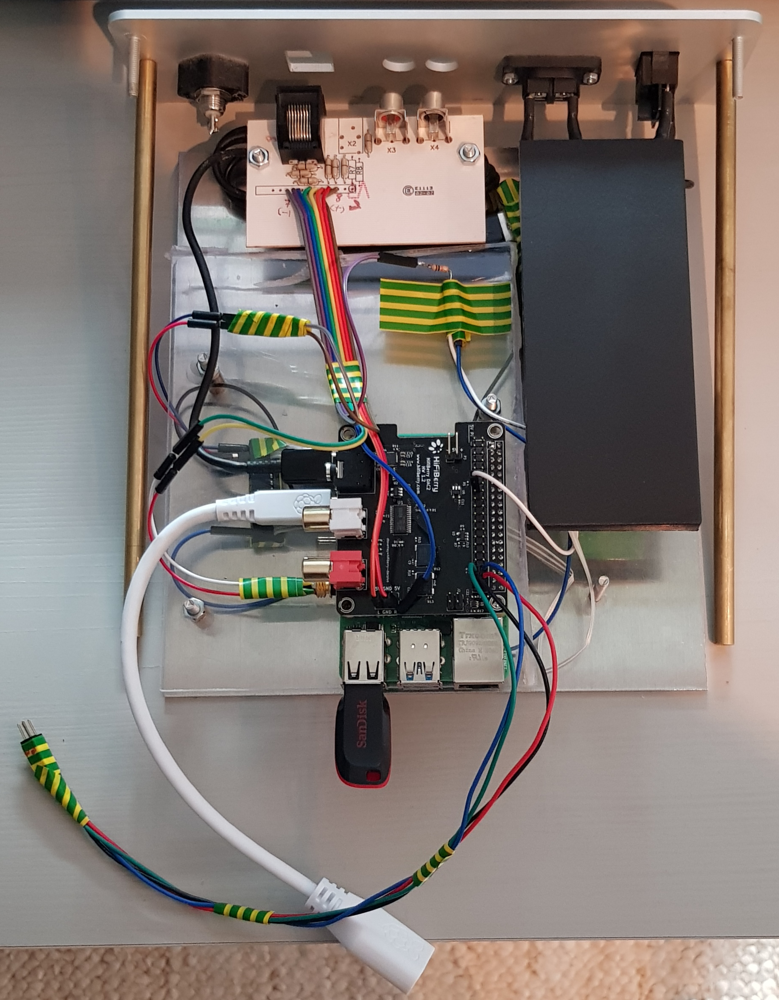
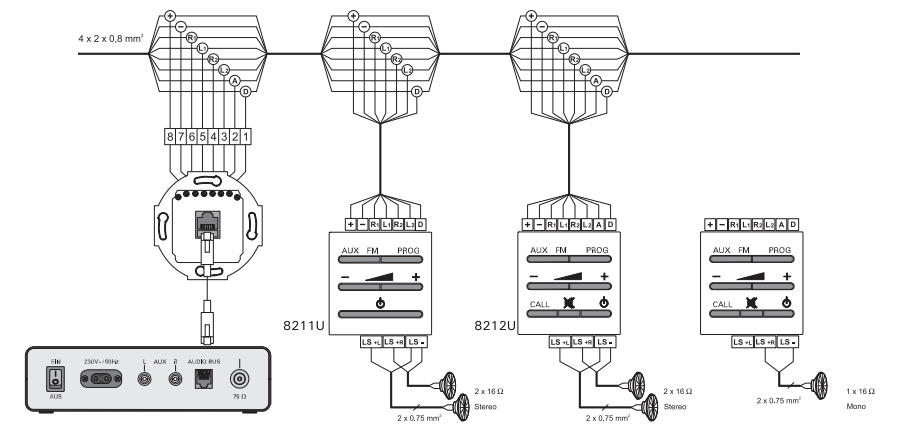
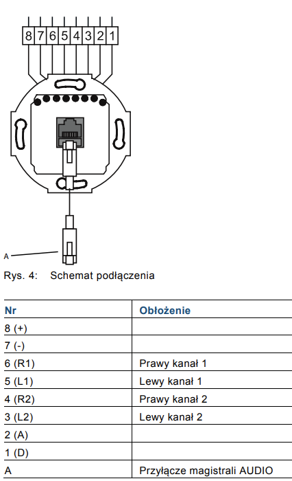

# Raspberry Media Center
Raspberry Pi based home media center

## Overview

Media center is based on:
- Raspberry Pi 4B with 8G RAM
- HiFiBerry DAC2 Pro - [documentation](https://www.hifiberry.com/shop/boards/hifiberry-dac2-pro/)
- 3x Busch und Jaeger 8212u and 1x8211u amplifiers - [documentation](https://library.e.abb.com/public/dec74a007bb7476d8d56ac41941bf79a/8211_ABB_OA_2012-12-17_PL_R01.pdf)
- Case from Busch und Jaeger 8201 Zentralle



### Bus connectivity

The system connectivity:



The RJ45 should be connected as below - consult bus color scheme:



| PIN | COLOR  | PURPOSE | Comment |
|-----|--------|---------|---------|
| 7   | Gray   | (-)     | GND     |
| 1   | Violet | D       | PROG    |
| 2   | Blue   | A       | CALL    |
| 6   | Green  | R1      | AUX     |
| 5   | Yellow | L1      | AUX     |
| 4   | Orange | R2      | FM      |
| 3   | Red    | L2      | FM      |
| 8   | Brown  | (+)     | VCC     |


Comments
- FM commected to HiFiBerry
- AUX connetected to internal Raspberry sound card and headphones output. This results in rather low output level and low quality. Potential improvement is to use pre-amplifier. The B&J system has an unbalanced input and this kind of preamplifier is reqiored. 
- D pin is used by the external amplifiers to send PROG signal to change the current playing radio station. This is via voltage divider (10k/18kOhm) to GPIO27 to encompass a fact that B&J uses 5V logic and RPi GPIO is 3.3V.
- Power supply
  - B&J uses built in 15V power supply from the 8201 unit
  - RPi uses 5V 2A cell phone charger
  - GND of both power supplies is connected to provide common reference GND

## Software

Following software is uesd:
- Raspian 11
- [MPD](https://www.musicpd.org/) for playing internet radio over FM channel. 
- custom daemon to handle GPIO
- [spotifyd](https://spotifyd.github.io/spotifyd/Introduction.html)

### Playback devices available
To list use `aplay -l`:
```
**** List of PLAYBACK Hardware Devices ****
card 0: Headphones [bcm2835 Headphones], device 0: bcm2835 Headphones [bcm2835 Headphones]
  Subdevices: 7/8
  Subdevice #0: subdevice #0
  Subdevice #1: subdevice #1
  Subdevice #2: subdevice #2
  Subdevice #3: subdevice #3
  Subdevice #4: subdevice #4
  Subdevice #5: subdevice #5
  Subdevice #6: subdevice #6
  Subdevice #7: subdevice #7
card 1: sndrpihifiberry [snd_rpi_hifiberry_dacplus], device 0: HiFiBerry DAC+ Pro HiFi pcm512x-hifi-0 [HiFiBerry DAC+ Pro HiFi pcm512x-hifi-0]
  Subdevices: 1/1
  Subdevice #0: subdevice #0

```
After installing Pulse and pairing bluetooth:
```
pi@raspberrypi:~ $ sudo pactl list cards short
0	alsa_card.usb-0d8c_USB_Sound_Device-00	module-alsa-card.c
1	alsa_card.platform-bcm2835_audio	module-alsa-card.c
2	alsa_card.platform-soc_sound	module-alsa-card.c
3	bluez_card.48_27_EA_30_97_C1	module-bluez5-device.c

pi@raspberrypi:~ $ sudo pactl list sinks short
0	alsa_output.usb-0d8c_USB_Sound_Device-00.analog-stereo	module-alsa-card.c	s16le 2ch 44100Hz	RUNNING
1	alsa_output.platform-bcm2835_audio.analog-stereo	module-alsa-card.c	s16le 2ch 44100Hz	SUSPENDED
2	alsa_output.platform-soc_sound.stereo-fallback	module-alsa-card.c	s16le 2ch 44100Hz	SUSPENDED

```


Testing audio:
```
apt install sox

#left
AUDIODEV=hw:3 play  -c 2 -n synth  sin 1000 remix 0 1
#right
AUDIODEV=hw:3 play  -c 2 -n synth  sin 1000 remix 1 0
```

### MPD 
Mostly default, except the audio sink to the 
```
audio_output {
	type		    "alsa"
	name		    "My ALSA Device"
	device		    "hw:1,0"	# optional
	mixer_type      "hardware"  # optional
	mixer_device	"default"	# optional
	mixer_index	    "0"	        # optional
}

```

Listing playlists
```
pi@raspberrypi:~ $ mpc lsplaylists
radio.mpl
pi@raspberrypi:~ $ mpc playlist
Radio Nowy Swiat: Kłusem z Bluesem - Randka w ciemno
https://stream.rcs.revma.com/an1ugyygzk8uv
```

Make sure that shuffle is enabled: `mpc shuffle`

Adding radio station to list:
```
mpc add <url>
```

Changing radio station (to make sure the list is looped):
```
mpc next;mpc play
```

### GPIO daemon
- consider using [pigpio](https://abyz.me.uk/rpi/pigpio/pigpiod.html)

Daemon config file: `/etc/systemd/system/gpiod.service`
Install:
```
cp src/gpio-listener.py ~pi/
sudo cp src/gpiod.service /etc/systemd/system/gpiod.service
sudo systemctl enable gpiod
```

### Driving projection screen

The setup uses a projection screen with 3 buttons:
- up
- stop 
- down

These are connected to [Whadda WPM400](https://whadda.com/product/4-channel-relay-module-wpm400/) relay module. The module has it's own separate 9V power source. Specially made cable is used to conect relay to the RPi. Connections:

| PIN  | GPIO   | Color   | Relay | Purpose |
|------|--------|---------|-------|---------|
| 31   | 6      | Blue    | 1     | UP      |
| 33   | 13     | Green   | 2     | DOWN    |
| 37   | 26     | Orange  | 3     | STOP    |
| 39   | GND    | Black   | GND   | GND     |

### Bluetooth
Bluetooth support based on [rpi-audio-receiver](https://github.com/nicokaiser/rpi-audio-receiver)

### Installation

```
sudo apt install git
git clone https://github.com/majduk/raspberry-media-center.git
cd raspberry-media-center
./install.sh
```
